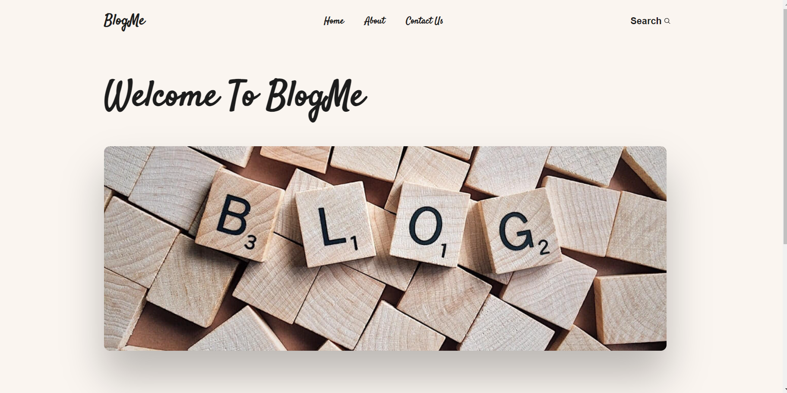

# Project Name | BlogMe

## Introduction
A Blog created using Node.JS, Express, and MongoDB along with several other 3rd party packages all listed in the dependencies part in the package file with the exact versions used.

## Installation
### Clone Repository
`git clone https://github.com/Yara-ib/BlogMe.git`

## Usage
### Navigate to the Project folder
`cd BlogMe`

### How To Run
Create the file ".env" with your database details (cloud or locally)

### Install dependencies
`npm install`

### Start Server
`npm run dev`

### To View it locally
`Go to >> localhost:3000`

## Contributing
If someone needed to contribute to the project, please add a new pull request.

## Related projects
Nothing Yet.

## Technical Challenges
Trying to do a website using Node.Js, Express.Js, and MongoDB was a bit challenging considering that i hadn't studied them before but thankfully it went well and learned about new packages that facilitates the workflow too.

The other thing was making sure the data from database retrieved perfectly; because i got the data saved at the database but wasn't showing up when i try to access it through the frontend.

## Licensing
MIT license
